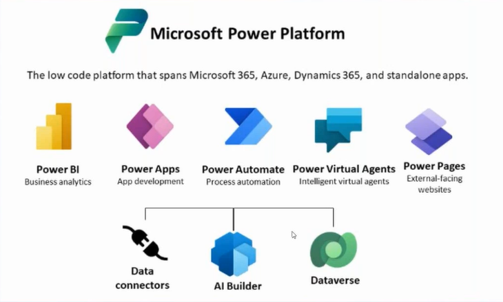

# Aprendiendo Power Apps

En este repositorio guardaré recursos sobre mi aprendizaje de Power Apps.

## Introducción

Según [Microsoft](https://learn.microsoft.com/en-us/power-apps/powerapps-overview), "Power Apps es una suite de apps, servicios y conectores, como así también una data platform, que provee un ambiente para el desarrollo ágil de aplicaciones a medida para las necesidades puntuales de cada empresa". En el siguiente [link](https://powerapps.microsoft.com/es-es/) podrán encontrar la página oficial.

Power Apps es parte de la power suite de Microsoft que contiene los elementos presentes en la siguiente figura:

